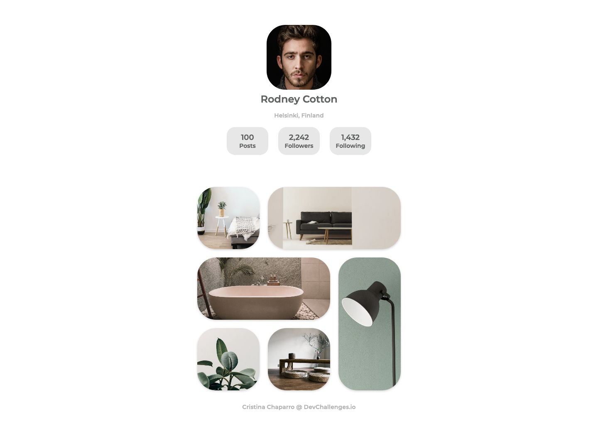
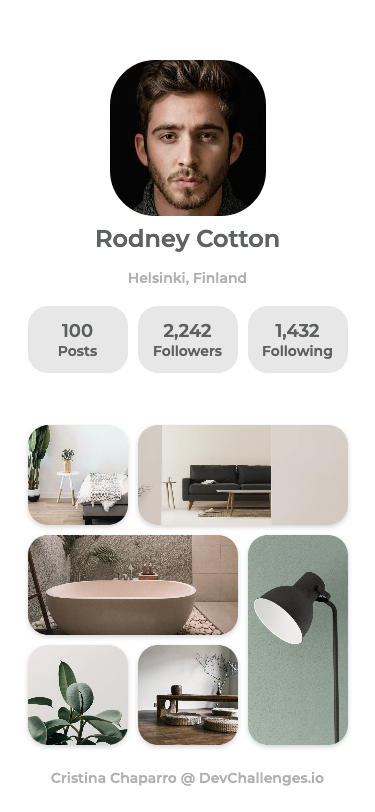

<!-- Please update value in the {}  -->

<h1 align="center">IG Styled Photo Gallery</h1>

   Solution for a challenge from  <a href="http://devchallenges.io" target="_blank">Devchallenges.io</a>.

  <h3>
    <a href="https://photogallery-pi.vercel.app/">
      Demo
    </a>
     | 
    <a href="https://github.com/nofsys/photogallery">
      Solution
    </a>
     | 
    <a href="https://devchallenges.io/challenges/gcbWLxG6wdennelX7b8I">
      Challenge
    </a>
  </h3>

<!-- TABLE OF CONTENTS -->

## Table of Contents

- [Overview](#overview)
  - [Built With](#built-with)
- [Features](#features)
- [Contact](#contact)
- [Acknowledgements](#acknowledgements)

<!-- OVERVIEW -->

## Overview

This is an IG styled photo gallery that I've been working on for Devchallenges.io. 

I chose this project for two main reasons, the first one is that I'm a photography lover myself, so it can be useful for me in the future; and the second one is that I feel that personal photography/product websites are quite trendy lately so it was worth learning how to create a site like this.

My main challenge here was to discover how to place each picture in this Pinterest-like layout, and that it kept that way even when using smaller screens. I tried placing each picture separately and the result wasn't good, but then I learned about CSS grid - which was completely new to me - and it was key to develop the website and make it look as I wanted.

As a side note, I also learned to look closely since I hadn't realised about certain margins between elements, or even the soft shadows under each picture. I was so focused on getting everything right in the place they had to be that I almost forgot about smaller details that make the site look good as well.

### Built With

HTML and CSS.

## Features

<!-- List the features of your application or follow the template. Don't share the figma file here :) -->

This application/site was created as a submission to a [DevChallenges](https://devchallenges.io/challenges) challenge. The [challenge](https://devchallenges.io/challenges/gcbWLxG6wdennelX7b8I) was to build an application to complete the given user stories.

## Contact

- GitHub [@nofsys](https://github.com/nofsys)
- Twitter [@nofsys](https://twitter.com/nofsys)
